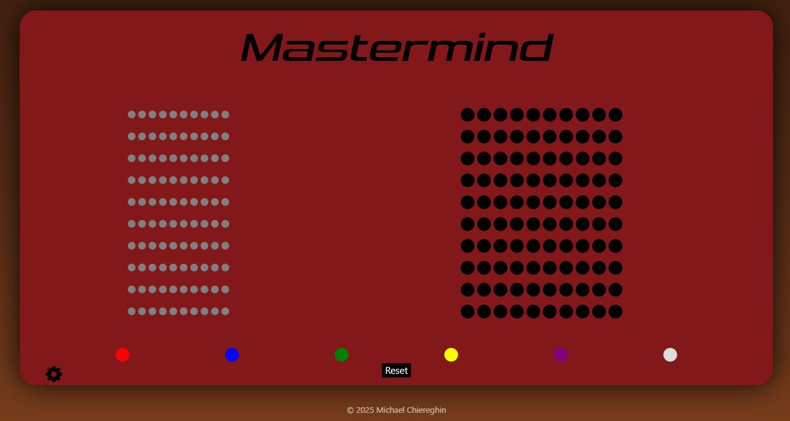
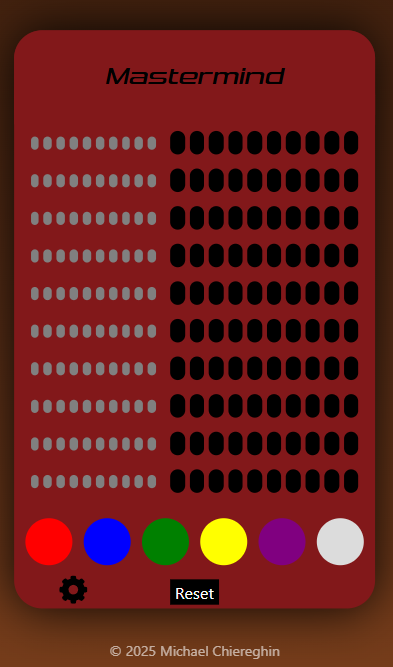
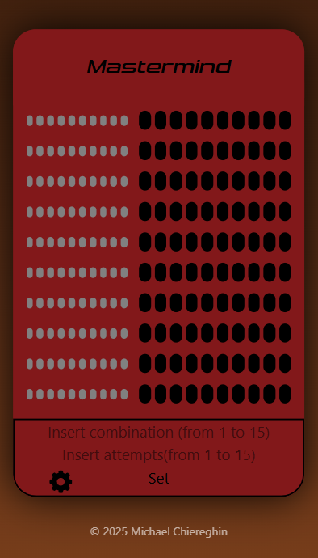

🎯 Mastermind React

A ground-up remake of the classic Mastermind, built in React to strengthen modular logic, deepen practical knowledge of the library, and sharpen the developer’s discipline through deliberate coding.

🚀 Features
🎨 Interactive Color Picker

🧠 Precise feedback (black and white pegs)

🔁 Instant reset for a new challenge

🧩 Randomly generated secret code

📱 Responsive layout with Tailwind

⚙️ Customizable combination length and guess limit

🛠️ Tech Stack
--React 18

--TailwindCSS

--Vite

🧪 Skills Trained
State and data flow management

Reusable, composable components

Pure game logic abstraction and testing

Debugging state & async flow

Responsive UI architecture with Tailwind

📸 Screenshots

📂 Installation
bash
git clone https://github.com/Michaelcrg/mastermind.git
cd mastermind-react
npm install
npm run dev

---
